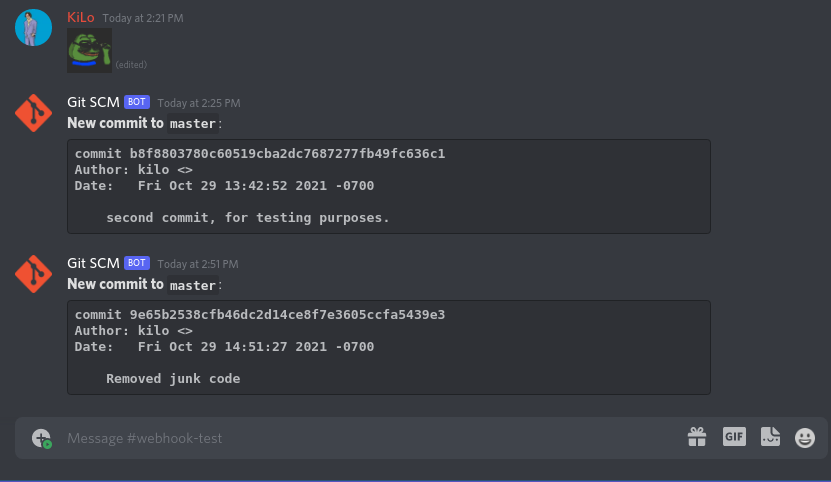

# Git-Notif
Sends messages to a Discord webhook whenever there is a new commit in your local git repository.

### Usage
Just drop [`notifier.py`](notifier.py) into your git hooks directory (by default, it's `.git/hooks`) and rename the file to `post-commit`. Update `post-commit`'s permissions to allow it to be executable: `chmod 755 post-commit`.

There is a configuration file (`.wh_config.json`) that's generated at the project level when the tool is first ran. You must edit this file and add your webhook's ID and token:
```
https://discord.com/api/webhooks/{id}/{token}
```

### Sample

