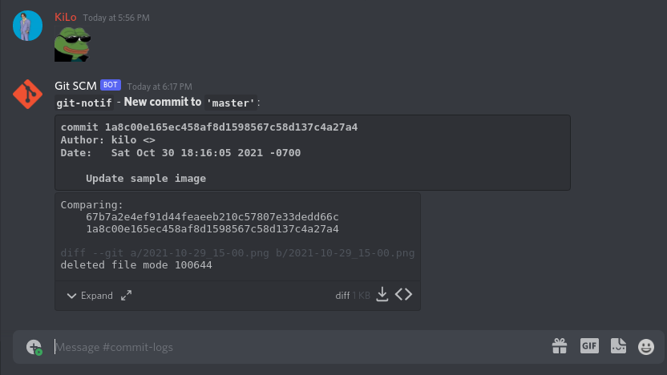

# Git-Notif
Sends messages to a Discord webhook whenever you make a new commit to your local git repository.

### Requirements
* [GitPython](https://gitpython.readthedocs.io/en/stable/intro.html#installing-gitpython)

### Usage
#### Recommended installation
Use the [`install-git-notif`](install-git-notif) installer script to install `git-notif` automatically into your git hooks directory. There is an environment variable that `install-git-notif` reads which will automatically set the webhook ID and token when it sets up your configuration file:
```
$ DISCORD_WH_URL="https://discord.com/api/webhooks/8378377823423423423/qwertyuiop" ./install-git-notif
```

#### Manual installation
Drop [`notifier.py`](notifier.py) into your git hooks directory (by default, it's `.git/hooks`) and rename the file to `post-commit`. Update `post-commit`'s permissions to allow it to be executable: `chmod 755 post-commit`.

There is a configuration file (`.wh_config.json`) that's generated at the project level when the tool is first ran. You must edit this file and add your webhook's ID and token:
```
https://discord.com/api/webhooks/{id}/{token}
```

### Sample

